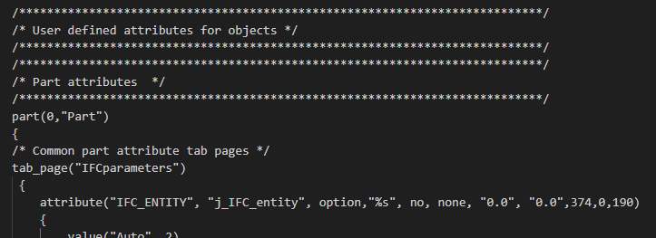
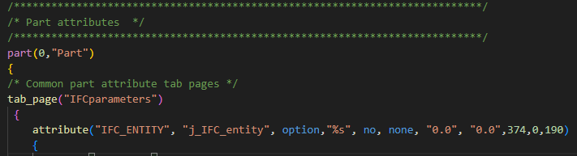
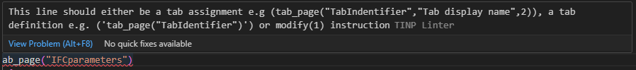

# Tekla Input file Linter

Developer tool that analyzes  [Tekla Structures Input files](https://support.tekla.com/doc/tekla-structures/2024/sys_input_files) for errors and stylistic issues.

## Functionality

This Language Server works for .inp files. It has the following language features:
- Diagnostics regenerated on each file change
- Syntax highlight

Before:

After:

Example diagnostic:

## Installation

In [Visual Studio Code](https://code.visualstudio.com/download) go to Extensions, and search for 'Tinp'.Once installed it should work straight away.

### Note:
Add Visual Studio Code as the default application to open .inp file types.